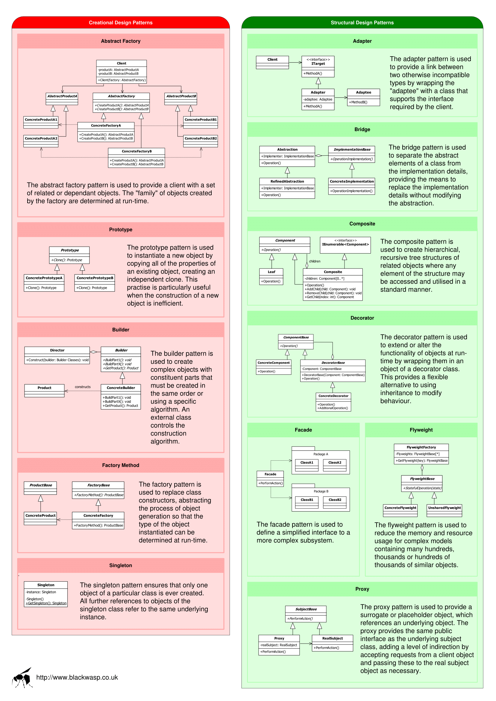

# Wzorce Projekotwe w Java

Wzorzec projektowy (ang. design pattern) – uniwersalne, sprawdzone w praktyce rozwiązanie często pojawiających się, powtarzalnych problemów projektowych. Pokazuje powiązania i zależności pomiędzy klasami oraz obiektami i ułatwia tworzenie, modyfikację oraz pielęgnację kodu źródłowego. Jest opisem rozwiązania, a nie jego implementacją. Wzorce projektowe stosowane są w projektach wykorzystujących programowanie obiektowe.

### Wzorce rozwiązań

Wzorce projektowe najczęściej tworzone są w oparciu o programowanie obiektowe. Zakres tego pojęcia stał się problemem rozważanym od połowy lat 90. XX wieku. Ostatecznie ustalono, że algorytmy nie są wzorcami projektowymi, jako że rozwiązują problemy obliczeniowe, a nie projektowe. Wzorce często są łączone w celu rozwiązania bardziej złożonego problemu.

Zamiast skupiać się na funkcjonowaniu poszczególnych elementów, wzorce projektowe stanowią abstrakcyjny opis zależności pomiędzy klasami, co w efekcie wprowadza pewną standaryzację kodu oraz zwiększa jego zrozumiałość, wydajność i niezawodność. Wartość wzorców projektowych stanowi nie tylko samo rozwiązanie problemu, ale także dokumentacja, która wyjaśnia cel, działanie, zalety danego rozwiązania, co pomaga w łatwiejszym stosowaniu i adaptacji wzorców w danym zastosowaniu.

Wzorce projektowe mogą przyspieszyć proces rozwoju oprogramowania przez dostarczenie wypróbowanych rozwiązań dla problemów, które mogą nie być oczywiste na początku procesu projektowego. Często zagadnienia te wiążą się rules ewolucją oczekiwań względem projektowanego systemu: rozszerzeniem jego funkcjonalności, zmianą sposobu i formatu wprowadzanych danych czy dostosowaniem aplikacji do różnych klas użytkowników. Nieuwzględnienie ich na początku procesu rozwoju produktu programistycznego powoduje często konieczność gruntownego przebudowywania zaawansowanego lub gotowego już oprogramowania.

### Klasyfikacja podstawowa

Wzorce możemy podzielić na trzy rodziny:

   - kreacyjne (konstrukcyjne) – opisujące proces tworzenia nowych obiektów; ich zadaniem jest tworzenie, inicjalizacja oraz konfiguracja obiektów, klas oraz innych typów danych;
   - strukturalne – opisujące struktury powiązanych ze sobą obiektów;
   - czynnościowe (behawioralne, operacyjne – opisujące zachowanie i odpowiedzialność współpracujących ze sobą obiektów.

[Wikipedia](https://pl.wikipedia.org/wiki/Wzorzec_projektowy_(informatyka))

------

### Creational Design Patterns: 

 - Builder
 - Factories
   - Factory Method  
   - Abstract Factory 
 - Prototype 
 - Singleton

### Structrural Design Patterns:

 - Adapter
 - Bridge
 - Composite
 - Decorator
 - Façade
 - Flyweight 
 - Proxy

### Behavioral Design Patterns:

 - Chain of Responsibility 
 - Command
 - Interpreter
 - Iterator 
 - Mediator 
 - Memento
 - Null Object 
 - Observer 
 - State 
 
   Stan – czynnościowy wzorzec projektowy, który umożliwia zmianę zachowania obiektu poprzez zmianę jego stanu wewnętrznego. Innymi słowy – uzależnia sposób działania obiektu od stanu w jakim się aktualnie znajduje.
   
   Rozważmy aplikację, której zadaniem jest rysowanie różnych obiektów za pomocą różnych komponentów. Aplikacja taka może posiadać abstrakcyjny interfejs reprezentujący narzędzie do rysowania implementowany przez klasy konkretnych narzędzi. Klasa główna będzie wywoływać odpowiednie narzędzie do rysowania - w zależności od tego w jakim będzie stanie. 
 
 - Strategy 
 - Template Method 
 - Visitor

------

### Obrazy

### UML

:warning: Zobacz [Gang of Four Design Patterns Reference Sheet](http://www.blackwasp.co.uk/GangOfFour.aspx)